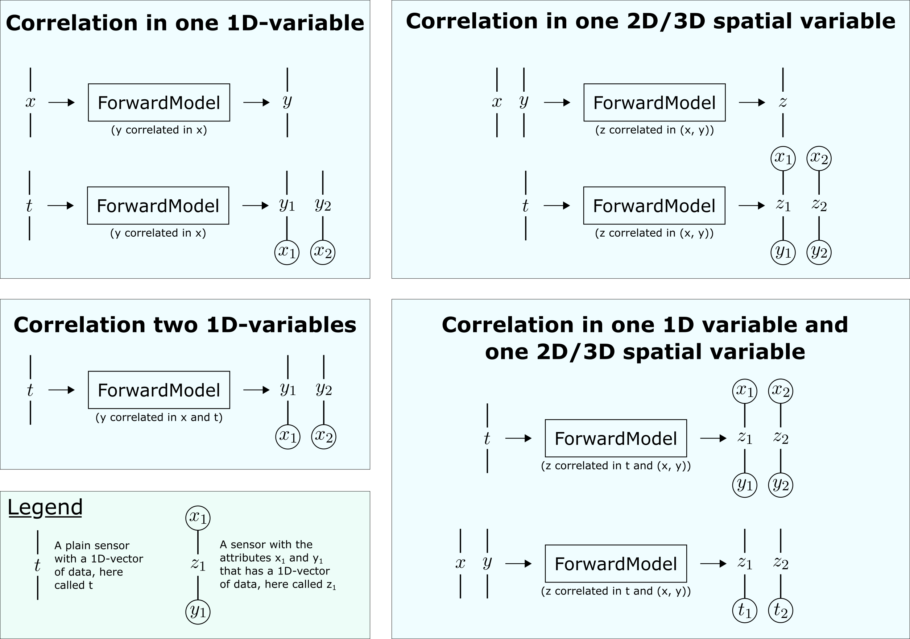

Components
**********

In order to provide a valid definition of an inverse problem (i.e., a parameter estimation problem) using probeye, four main ingredients (or components, as they are called here) are required.

1. Parameters
2. Forward models
3. Experiments
4. Likelihood models

These four components have to be defined by the user in a way of `adding` them to a problem instance. Consequently, the base structure of the corresponding probeye-code looks like this:

.. code-block:: python

    from probeye.definition import InverseProblem

    # initialize a problem instance
    problem = InverseProblem("MyProblem")

    # add the four components
    problem.add_parameter(...)
    problem.add_forward_model(...)
    problem.add_experiment(...)
    problem.add_likelihood_model(...)

Of course the dots in parenthesis :code:`(...)` still need to be further specified (according to the problem at hand), but the fundamental structure of how to define an inverse problem is given by the code block above. It should be pointed out that of each component multiple instances can be added - for example five parameters, two forward models, one hundred experiments and ten likelihood models - but at least one instance of each is required to obtain a valid problem definition. Also the order of adding those components should look like above. So, at first the parameters are added, then the forward models followed by the experiments and the likelihood models are added at last. Each of these components is explained in more detail in the following sections.

Parameters
##########
In probeye, an inverse problem is understood as a parameter estimation problem. Hence, it comes at no surprise that one needs to define at least one parameter that should be inferred. After initializing an inverse problem, adding the parameters to the problem is the natural next step. In principle, you could also add the experiments first, but it is recommended to begin with the parameters, because problem definitions are more readable like that.

Latent and constant parameters
------------------------------
Generally, two kinds of parameters are distinguished in probeye: latent and constant parameters. This property is also referred to as the parameter's `role`. Latent parameters are parameters that should be inferred, while constant parameters have a pre-defined value, and will hence not be inferred in the inference step. Earlier, it was pointed out that the definition of at least one parameter is required for a valid problem definition. Now we should state more precisely: the definition of at least one latent parameter is required for a valid problem definition.

A typical definition of a latent parameter looks like this:

.. code-block:: python
    :emphasize-lines: 4

    problem.add_parameter(
        "a",
        "model",
        prior=("normal", {"mean": 1.0, "std": 2.0}),
        tex="$a$",
        info="Slope of the fitted function",
    )

And a typical definition of a constant parameter looks like this:

.. code-block:: python
    :emphasize-lines: 4

    problem.add_parameter(
        "sigma_meas",
        "likelihood",
        const=0.1,
        tex="r$\sigma_\mathrm{meas}$",
        info="Standard deviation of measurement error",
    )

As one can see, the definition of either a latent or a constant parameter is triggered by using the :code:`prior` or the :code:`const` keyword argument in the :code:`add_parameter`-method. The :code:`const` keyword argument can be a scalar like in the example above or a numpy-based vector, for example :code:`const=np.array([0.9, -0.3])`. The :code:`prior` keyword argument on the other hand has to be given as a pair, where the first element states the kind of distribution (possible options are currently :code:`"normal"`, :code:`"uniform"`, :code:`"lognormal"`, :code:`"truncnormal"`, :code:`"weibull"`), and the second argument is a dictionary stating the prior's parameters. More information on the priors is given in this :ref:`section<Prior definition of latent parameters>` below.

Finally, it should be pointed out that it is possible to give a very short definition of a latent parameter by neither specifying the :code:`prior` nor the :code:`const` keyword argument. Examples could look like this:

.. code-block:: python

    problem.add_parameter("a")
    problem.add_parameter("b", domain="(0, 1]")

In both of these cases an `uninformative` prior is assumed, meaning a prior that is constant over its domain. Note however, that internally, the `uninformative` prior is not a proper prior like the conventional prior classes, but just a flag stating that the corresponding parameter is a latent parameter without a prior. These types of latent parameters can only be used for maximum likelihood estimations. When using a sampling-based solver, it is required to specify a proper prior.

A parameter's name and type
---------------------------
Each parameter (latent and constant) must have a name and a type. The parameter's name, which is given by the first argument in the :code:`add_parameter`-method,  must be unique in the scope of the problem, i.e., no other parameter can have the same name. This name is also referred to as the parameter's `global name`.

The parameter's type (given as the second argument), on the other hand, states where the parameter appears in the problem definition. There are three possible types :code:`model`, :code:`prior` and :code:`likelihood`. A parameter of type :code:`model` appears in one the problem's forward models, while a parameter of type :code:`prior` will be used in the definition of some latent parameter's prior. Finally, a parameter of type :code:`likelihood` will appear in one of the problem's likelihood models. The specification of the prior type is optional. If it is not given, it will be determined automatically.

Prior definition of latent parameters
-------------------------------------
As described above, when defining a latent parameter, one has to provide a 2-tuple which first contains a string describing the parameter type followed by a dictionary stating the prior's parameters and their values. The following table provides the currently implemented options.

.. list-table::
    :widths: 25 25 50
    :header-rows: 1

    * - Prior type
      - Prior parameters
      - Comments
    * - "normal"
      - :code:`mean`, :code:`std`
      - Gaussian or normal distribution where :code:`mean` refers to the mean and :code:`std` to the standard deviation.
    * - "multivariate-normal"
      - :code:`mean`, :code:`cov`
      - Multivariate normal distribution where :code:`mean` refers to the mean and :code:`cov` to the covariance matrix.
    * - "lognormal"
      - :code:`mean`, :code:`std`
      - Log-normal distribution where :code:`mean` refers to the mean and :code:`std` is the standard deviation on the log-scale.
    * - "truncnormal"
      - :code:`mean`, :code:`std`, :code:`a`, :code:`b`
      - Truncated normal distribution. Same as for "normal", while :code:`a` and :code:`b` refer to the lower and upper bound respectively.
    * - "uniform"
      - :code:`low`, :code:`high`
      - Uniform distribution where :code:`low` is the lower and :code:`high` is the upper bound. Note that these bounds are inclusive.
    * - "weibull"
      - :code:`loc`, :code:`scale`, :code:`shape`
      - Weibull distribution. Check out the `scipy-documentation <https://docs.scipy.org/doc/scipy/reference/generated/scipy.stats.weibull_min.html>`_ for more information on the parameters.

It should be pointed out that it is also possible to use a latent parameter as a prior parameter. The following example may illustrate that.

.. code-block:: python

    problem.add_parameter(
        "mean_a",
        "prior",
        prior=("uniform", {"mean": -1.0, "std": 1.0}),
        tex="r$\mu_a$",
        info="Mean parameter of a's prior",
    )
    problem.add_parameter(
        "a",
        "model",
        prior=("uniform", {"mean": "mean_a", "std": 2.0}),
        tex="$a$",
        info="Slope of the fitted function",
    )

Note that instead of providing a numeric value for :code:`a`'s :code:`mean` parameter, the name (hence a string) of the previously defined latent parameter :code:`mean_a` is provided. It is important in this example that :code:`mean_a` is defined before :code:`a`, which refers to :code:`mean_a` is defined.

A latent parameter's domain
---------------------------
Sometimes, the value of a latent parameter should stay in certain bounds. For example, if a parameter appears in the denominator of a fraction, it cannot assume the value zero. One measure to address such situations is to define the parameter's prior in a way that its domain does not contain problematic values. However, during sampling-procedures it is still possible that values outside of a prior's domain are proposed, and hence evaluated. To prevent that one can define a latent parameter's domain via the :code:`domain` argument when adding it to the problem. This would look like this:

.. code-block:: python

    problem.add_parameter(
        "gamma",
        domain="(0, 1)",
        prior=("uniform", {"low": 0.0, "high": 1.0}),
    )

Here, the domain of :code:`gamma` is specified to an open interval from zero to one. Other valid strings for the domain argument are for example :code:`"[0, 1]"` for a closed interval, :code:`"(0, 1]"` or :code:`"[0, 1)"` for half-closed intervals, or :code:`"(-oo, oo)"` for a domain from minus to plus infinity. Other variations are of course possible. For a multivariate parameter, the definition looks very similar as shown by the following example.

.. code-block:: python

    problem.add_parameter(
        "mb",
        dim=2,
        domain="(-oo, +oo) (-oo, +oo)",
        prior=(
            "multivariate-normal",
            {
                "mean": np.array([0.0, 0.0]),
                "cov": np.array([[1.0, 0.0], [0.0, 1.0]]),
            },
        ),
    )

So in this case, the :code:`domain`-string is simply a concatenation of :code:`domain`-strings for a 1D-interval. Note that for multidimensional parameter, also a :code:`dim`-argument is required, that specifies the parameter's dimensionality. If a latent parameter is added to a problem without specifying its domain, it is assumed that there are no restrictions. So, in the code block above, the domain-specification would actually be unnecessary since this domain would also have been assumed if no domain was specified.

The tex and info arguments
--------------------------
Each parameter can (but does not have to) have a tex and an info attribute. While the tex attribute is used for plotting, the info string is used when calling a problems info-method :code:`problem.info()` printing some information on the defined problem. Even if not required, it is recommended to define both of these attributes for each parameter added to the problem.

Forward models
##############
The forward model is a parameterized simulation model (e.g. a finite element model) the predictions of which should be compared against some experimental data. The parameters of the forward model are typically the parameters which are of primary interest within the stated problem. It should be pointed out that many inverse problems might contain only one forward model, but it is also possible to set up a problem that contains multiple forward models.

.. image:: images/forward_model.png
   :width: 600

In probeye, a forward model is a function that has two kinds of arguments: input sensors and parameters, see also the sketch above. While input sensors refer to specific experimental data, parameters refer to the problem's parameters. Once all input sensors and parameters are provided, the forward model computes a result that it returns via its output sensors.

In order to add a forward model to an inverse problem, two steps are required. At first, the forward model has to be defined. This definition is done by setting up a new model class (that can have an arbitrary name) which is based on the probeye-class :code:`ForwardModelBase`. This class must have both a :code:`interface`-method, which defines the forward model's parameters, input sensors and output sensors, and it must have a :code:`response`-method, which describes a forward model call. The :code:`response`-method has only one input, which is a dictionary that contains both the input sensors and the parameters. The method will then perform some computations and returns its results in a dictionary of the forward model's output sensors. For a simple linear model, such a definition could look like this:

.. code-block:: python

    class LinearModel(ForwardModelBase):
            def interface(self):
                self.parameters = ["m", "b"]
                self.input_sensors = Sensor("x")
                self.output_sensors = Sensor("y")

            def response(self, inp: dict) -> dict:
                x = inp["x"]
                m = inp["m"]
                b = inp["b"]
                return {"y": m * x + b}

After the forward model has been defined, it must be added to the problem. For the example shown above, this would look like this:

.. code-block:: python

    # add the forward model to the problem
    problem.add_forward_model("LinearModel", LinearModel())

The first argument states the name of the forward model within the problem. It will be referred to when adding experiments to the problem. In principle, one can chose any name for a forward model, but it is recommended to use the same name as the forward model class, as done in the example above.

Experiments
###########
The experiments that are added to an inverse problem are the carriers of the experimentally recorded data that is used to calibrate the problem's parameters with. If we stay in the example discussed before, this could look like this:

.. code-block:: python

        problem.add_experiment(
            "TestSeries_Aug12_2018",
            fwd_model_name="LinearModel",
            sensor_values={
                "x": np.array([0., 1., 2., 3., 4., 5.]),
                "y": np.array([1.75,  4.08,  6.91,  9.23, 11.67, 14.09]),
            },
        )

The first argument (here: "TestSeries_Aug12_2018") is a unique name of the experiment. The second argument states the name of the forward model this experiment refers to (here: "LinearModel"). This name has to coincide with one of the forward models that have been added before the experiment is added. The third argument states the actual measurement data, i.e., the values that have been recorded by the experiment's sensors. Those values can be given as scalars (float, int) or as vectors in form of numpy arrays. Note however, that these arrays have to be one-dimensional and cannot be of higher dimension.

There are several requirements that have to be met when adding an experiment to the inverse problem. Those requirements are:

- Experiments are added to the problem after all forward models have been added.
- All experiments are added to the problem before the likelihood models are added.
- All of the forward model's input and output sensors must appear in the dictionary given by the "sensor_values" argument.
- The dictionary-values of the "sensor_values"-argument can be scalars or 1D-numpy array. Arrays with higher dimensionality are not permitted.

Likelihood models
#################
The inverse problem's likelihood model's purpose is to compute the likelihood (more precisely the log-likelihood) of a given choice of parameter values by comparing the forward model's predictions (using the given parameter values) with the experimental data. In this section, we will only consider likelihood models that don't account for possible correlations. In such a framework, the addition of a likelihood model to the inverse problem for our example could look like this:

.. code-block:: python

        problem.add_likelihood_model(
            GaussianLikelihoodModel(
                prms_def={"sigma": "std_model"},
                experiment_names=["TestSeries_Aug12_2018"],
                sensors=linear_model.output_sensors,
            )
        )

